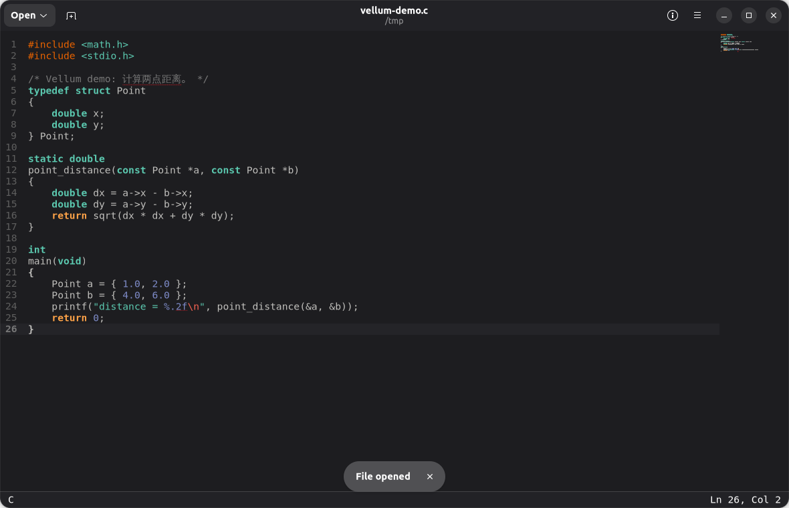
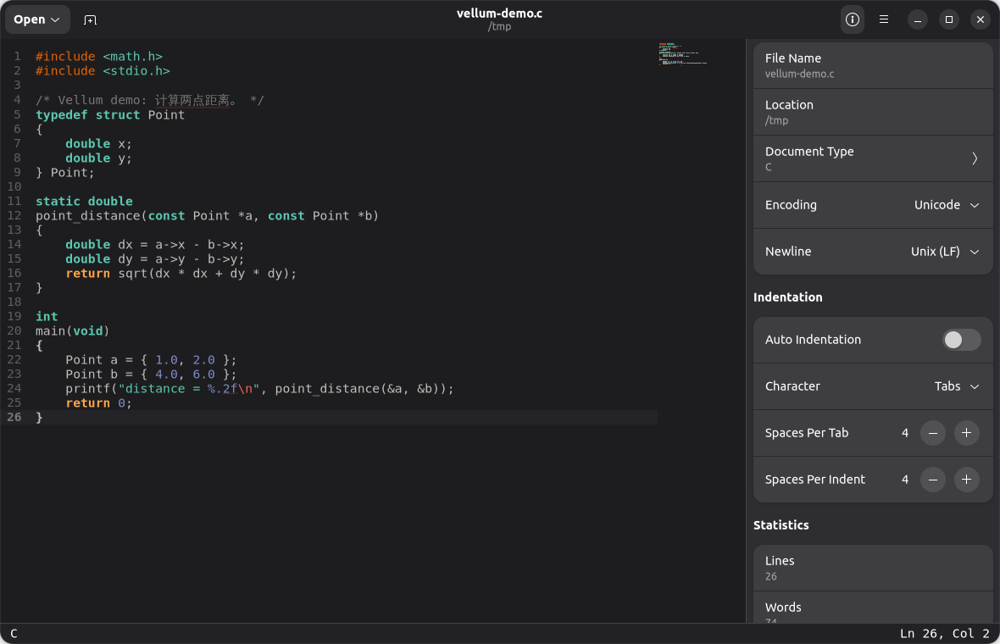
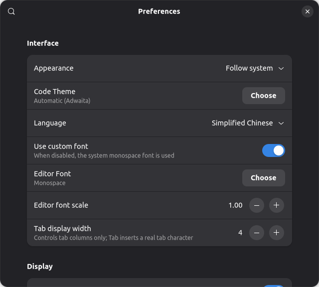

# Vellum

**Vellum** 是一款以 GNOME Text Editor 的干净工作流为参考、使用 **C、GTK4、Libadwaita 与 GtkSourceView 5** 编写的桌面文本编辑器。项目采用以可维护性为优先的 BSD Allman 风格；项目自身的注释和面向中文开发者的说明使用中文，界面通过 Gettext 提供英语与简体中文。

> 本项目的“ANSI C”要求解释为：业务代码避免 C99/C11 扩展性语法、保持 C90 式声明与控制流，并通过 GTK4/GLib 所要求的现代工具链编译。GTK4 本身是现代 C API，故不能以严格 `-std=c89 -pedantic` 约束第三方头文件。

## 界面预览







> 截图在深色模式下拍摄；实际外观跟随系统主题，可在菜单与首选项中切换浅色 / 深色 / 跟随系统。

## 功能范围

| 模块 | 已规划能力 | 设计要点 |
|---|---|---|
| 编辑 | 多文档标签、打开/新建/保存/另存为、外部拖放、修改状态、外部文件变更提示 | 每个标签由独立 `MtDocument` 管理；检测到磁盘改动时不会自动覆盖本地内容，用户可选择丢弃更改并重新载入 |
| 代码体验 | 语法高亮、行号、当前行高亮、概览图、右边界、自动折行/缩进、自定义字体、缩放、真实 Tab | Tab 始终写入 U+0009；首选项仅控制 1–16 列的视觉宽度，不将 Tab 转换为空格；支持缩放重置 |
| 语言识别 | 按扩展名、shebang 与常见源码/结构特征推断 | 不依赖阻塞式 MIME 查询；打开文件及停止编辑约 450 ms 后都会刷新当前语言 |
| 轻量诊断 | 对未闭合或错配的 `()[]{}` 与未闭合引号标记错误波浪线 | 这是编辑时启发式提示，不是编译器、语言服务器或安全审计结果 |
| 查找 | 查找、上一个/下一个、替换当前匹配项 | 底部可收起查找栏，快捷键驱动 |
| 恢复 | 延迟快照、可选的下次启动草稿恢复 | 草稿保存在用户状态目录，不静默覆写原文件；可在首选项关闭恢复 |
| 体验 | GNOME/Adwaita 标题栏、浅色/深色/跟随系统、状态提示 | 遵循 Libadwaita 原生表面；深色编辑区完全使用 GtkSourceView 官方 `Adwaita-dark` 方案，不以自定义紫黑 CSS 覆盖 token 色 |
| 代码主题 | 可视化主题卡片、实时 C 语法预览、持久化选择 | “首选项 → 代码主题 → 选择”以两列卡片列出系统已安装的 GtkSourceView 方案；点击即应用，Vellum 不复制第三方主题资源 |
| 国际化 | English 与简体中文 | 独立 `en.po` 与 `zh_CN.po` 语言包；语言偏好下次启动生效 |
| 插件 | 基于 `GModule` 的动态扩展、持久化启停与删除、导入/导出、配置与版本协商 | 所有内置扩展以源码 `.vut` 包分发；附带时间戳、统计、AI 补全（含自动代码摘要）、链接测试、项目侧边栏、构建运行、Vi Mode 与新手引导。首选项可关闭全部扩展，重启后只运行核心编辑器。 |
| AI 补全 | 用户自填 OpenAI 兼容服务 URL、模型与 API 密钥；手动请求或输入停顿后自动请求 | 自动把裸主机地址归一化为 `/chat/completions`，也接受完整 URL 或 `/v1` 基础地址；请求同时携带光标前（前缀）与光标后（后缀）上下文；结果以约 50% 透明内联候选显示，`Tab` 接受、`Escape` 取消，候选不写入文件。对支持该字段的服务会请求非思考模式以降低内联延迟。 |
| AI 代码总结 | 按文件类型独立开关（源码/脚本/Web/结构化数据），达到可配置累计修改行数后自动发送摘要供补全上下文复用 | 摘要仅保存在内存中，不写入磁盘；每轮新文档独立计算基线；低于 30 行触发间隔时在配置界面给出 token 消耗警告。`Ctrl+Alt+S` 可手动生成一次。 |
| 链接测试 | 手动提取并检查当前文档中的 HTTP/HTTPS URL | `Ctrl+Shift+L` 最多顺序请求 32 个唯一链接，以小范围 Range GET 汇总可达/失败数量 |
| 工作流扩展 | 项目侧边栏、独立构建运行窗口与 Vi Mode | 侧边栏只枚举用户选择的目录；构建/运行只执行用户显式配置的直接参数命令并在独立工具窗口显示输出；Vi 模式可随时禁用 |

## 目录结构

```text
.
├── data/                    # 图标、桌面入口与 AppStream 元数据
├── docs/                    # 架构、调试协议与扩展格式等设计文档
├── packaging/
│   ├── appimage/            # Linux AppImage 打包脚本与 AppDir 定义
│   └── windows/             # MinGW 交叉编译 Meson 配置与说明
├── po/                      # gettext 翻译文件
├── screenshots/             # README 界面截图
├── src/
│   ├── plugins/             # 内置动态插件
│   ├── mt-application.*     # 应用生命周期、动作与插件加载
│   ├── mt-window.*          # GNOME 风格主窗口与编辑命令
│   ├── mt-document.*        # 文档、文件 I/O、快照恢复
│   ├── mt-plugin.*          # 插件加载器与主机 API
│   └── mt-settings.*        # 无 GSettings schema 依赖的用户偏好
└── meson.build              # 根构建描述
```

## 构建依赖

| 平台 | 基础依赖 | 状态 |
|---|---|---|
| Linux | GTK 4、Libadwaita 1、GtkSourceView 5、GLib/GIO、libsoup 3、JSON-GLib、Meson、Ninja、Gettext | 主开发与 AppImage 测试目标 |
| Windows | MSYS2 MinGW-w64 版 GTK4、Libadwaita、GtkSourceView、libsoup、JSON-GLib、Meson、Ninja | 提供交叉构建定义；需要匹配的 Windows 依赖前缀 |

## Linux 开发构建

```bash
meson setup build
meson compile -C build
./build/src/vellum
```

可在启动前显式测试英语或中文语言包：

```bash
LANGUAGE=en ./build/src/vellum
LANGUAGE=zh_CN.UTF-8 ./build/src/vellum
```

在“首选项”中可选择系统语言、English 或简体中文；同时可选择系统已安装的编辑器字体，并调整字体缩放比例。“代码主题”行会打开独立的主题卡片窗口，实时显示与编辑器相同的 GtkSourceView C 语法预览；选中卡片后会立即应用并保存。“键盘快捷键”窗口中点击任一动作的组合键即可录入、立即应用并持久化新的快捷键。若希望完全简化界面，可在“首选项 → 行为”关闭“启用扩展”并重启：Vellum 不会创建插件管理器、加载动态模块或显示扩展面板。

## 快捷键

| 快捷键 | 操作 |
|---|---|
| `Ctrl+N` | 新建标签页 |
| `Ctrl+O` | 打开文件 |
| `Ctrl+S` | 保存 |
| `Ctrl+Shift+S` | 另存为 |
| `Ctrl+W` | 关闭当前标签页 |
| `Ctrl+F` | 显示查找栏 |
| `Ctrl+H` | 显示查找与替换栏 |
| `Ctrl++` / `Ctrl+-` / `Ctrl+0` | 放大 / 缩小 / 重置编辑器字体 |
| `Ctrl+Shift+T` | 通过时间戳扩展插入 ISO 8601 本地时间 |
| `Ctrl+Shift+W` | 通过文档统计扩展显示字符、词语和行数 |
| `Ctrl+Shift+Space` | 通过 AI 补全扩展请求半透明候选；`Tab` 接受、`Escape` 取消 |
| `Ctrl+Alt+S` | 手动触发 AI 代码总结（需先开启相应文件类型开关） |
| `Ctrl+Shift+L` | 通过链接测试扩展检查当前文档中的 HTTP/HTTPS 链接 |
| `F9` / `F10` / `F11` | 通过构建运行扩展构建 / 运行 / 构建并运行（需先配置） |

## 插件 ABI

插件在运行时是编译为共享库的 C 模块，必须导出 `mt_plugin_query` 和 `mt_plugin_activate`，可选导出 `mt_plugin_deactivate`。插件只能通过 `MtPluginHost` 表中的函数访问编辑器，不应保存窗口或文档的裸指针。主程序会从以下位置加载已构建模块：

```text
<安装前缀>/lib/vellum/plugins/
~/.local/share/vellum/plugins/
```

内置扩展源码包由 `packaging/vut/build-source-packages.sh` 生成至 `dist/vut-source/`。`.vut` 是包含 `vellum-extension.ini`、扩展源码、`mt-plugin.h` 和 Makefile 的 ZIP 包；源码包导入时会校验 OS、插件 API、路径和声明工具，并在私有临时目录使用参数数组启动 `make`/`cc`。Linux 源码包要求 `make`、`cc`、`pkg-config` 与其清单列出的 GTK/GLib 等开发依赖；`architecture=any` 与 `abi=any` 允许在同一 OS 为当前 CPU 重新构建，但不能让 `.so` 跨 Windows、Linux、BSD 或直接跨 ABI 使用。完整字段与安全边界见 `docs/docs_vut_extension_format.md`。

主菜单的“扩展”页面会列出模块名称、说明、版本与启用开关。禁用会移除扩展的动作、快捷键和面板，但不删除其文件；启用与删除状态保存于用户配置目录。导出、配置和删除使用带工具提示的紧凑图标操作。任何扩展都可以删除：用户导入模块连同磁盘文件一起删除；内置模块从列表中隐藏并立即卸载，重启后不再加载，且无法从应用内恢复。新手引导插件在导览完成后会请求自我删除；若选择保留，主菜单会显示“新手引导”入口。关闭“启用扩展”总开关并重启后，扩展页会明确显示当前为核心模式且不允许导入或加载模块。模块名称和说明会在写入 Adwaita 偏好行前安全转义，因此 `Build & Run` 等包含 `&` 的名称不会再触发 markup 警告。原生源码扩展不会被沙箱隔离，必须只导入可信来源。

## AI 补全配置与隐私

在“扩展”页面选择 **AI Completion → 配置**，输入完整的 OpenAI 兼容 Chat Completions URL、模型名称和 API 密钥。密钥会保存在当前用户配置目录下的 `vellum/ai-completion.ini`，写入后设置为仅当前用户可读写的 `0600` 权限。建议使用 HTTPS；为支持本机兼容服务，界面同时接受 `http://` 地址。

> AI 补全是**手动触发**功能。只有按下 `Ctrl+Shift+Space` 时，光标之前最多 8,000 个字符才会被发送给用户配置的服务。请仅配置自己信任的服务地址，并避免将不应离开本机的敏感内容发送到第三方。

## TUI 调试与图形回归

构建会同时生成 `build/src/vellum-tui-debug`。该受限工具创建真实 GTK 窗口，但通过标准输入读取白名单命令，并以 JSON 行返回文档、保存、扩展面板和可见性状态；默认使用临时配置且关闭扩展。它适合在 Xvfb、云主机或 CI 中验证 GUI 行为，而不是替代图形编辑器。协议、命令与安全边界见 [`docs_tui_debugger.md`](docs/docs_tui_debugger.md)。

## 发行说明

开发阶段首先验证 **Linux AppImage**。`packaging/appimage/build-appimage.sh` 会从 Meson staging 目录构建 AppDir；在合适的环境中使用 `appimagetool` 生成单文件 AppImage。`.deb` 包和 Windows 安装包不在本阶段产出，但 Windows 的 Meson 交叉文件、依赖约束和构建说明会随源码提供。

## English summary

Vellum is a clean GTK4/Libadwaita text editor, inspired by GNOME Text Editor but implemented independently. It is written predominantly in portable, C90-style C with BSD Allman formatting, while using the modern GTK4 API. It provides real U+0009 tabs with configurable visual width, live content-aware language recognition, heuristic error underlines, overview maps, editor display and indentation preferences, find/replace, optional session recovery, English and Simplified Chinese gettext packs, a keyboard shortcut reference, and an independent visual code-theme chooser with live GtkSourceView previews. Optional Project Sidebar, Build & Run, Vi Mode, link testing and AI completion extensions can be enabled independently. AI completion sends the text around the cursor to a user-configured OpenAI-compatible service, either on demand or after a short typing pause, and shows the continuation as ghost text accepted with Tab. Turning off extensions in Preferences and restarting leaves a compact core editor with no dynamic modules. A restricted `vellum-tui-debug` companion drives a real GTK window through a JSON-line debugging protocol for repeatable GUI tests. All built-in extensions are distributed as auditable Linux source `.vut` ZIP packages that are rebuilt for the local architecture when compatible tools and development dependencies are present. The Vellum source, documentation, metadata and tests are BSD-2-Clause; Linux AppImage is the initial validated distribution target, and a Windows MinGW cross-build configuration is also supplied.

## 许可证

本项目自有源码、文档与元数据使用 **BSD-2-Clause**；见 `LICENSE` 与 `LICENSE_AUDIT.md`。GtkSourceView、GTK、Libadwaita、libsoup 与 JSON-GLib 是按其各自许可证动态链接的运行时依赖，当前 AppImage 构建不会将这些库打包为 Vellum 自有内容。

Copyright (c) 2026 Vellum contributors.

## 安全与隐私

草稿恢复数据只保存在当前用户的本机状态目录。除 AI 补全和链接测试扩展外，编辑器和其他示例插件不进行网络访问。AI 扩展仅在用户手动触发后向用户配置的服务发送有限的光标前上下文；链接测试仅在用户按下 `Ctrl+Shift+L` 后访问当前文档中列出的 HTTP/HTTPS 地址；详见“AI 补全配置与隐私”。
